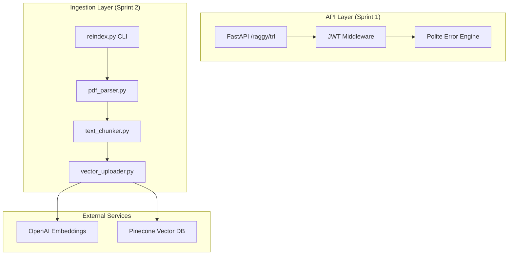

# 📊 Project Progress Report: Sprints 1 & 2

The "Raggy Bot" RAG microservice has successfully completed its first two sprints. The project is firmly on track, combining high-security standards with a robust data ingestion pipeline, all while adhering to the ISO 29110 standard.

## 🏗️ Current Architecture Overview

## ✅ Sprint 1: Security & API Foundation
**Goal**: Build a secure, professional entry point.
*   **Production Port**: Explicitly bound to `8001`.
*   **JWT Security**: Decodes frontend tokens and extracts roles (`admin`/`researcher`). Safely defaults to `researcher` if role is missing.
*   **Polite Error Engine**: Custom FastAPI exception handlers return canned, empathetic responses for 422 (Validation) and 401 (Auth) errors to prevent data leakage and provide a premium user experience.
*   **CORS**: Whitelisted for `http://localhost:3000`.

## ✅ Sprint 2: Ingestion Engine & Vector Database
**Goal**: Transform raw TRL PDFs into searchable, secure vectors.
*   **PDF Parsing**: Implementation of `PDFParser` using LangChain. Automatically detects `source/private/` paths to set `access='private'` metadata.
*   **Chunking Strategy**: `RecursiveCharacterTextSplitter` used with `chunk_size=1000` and `chunk_overlap=150` to maintain semantic context.
*   **Vector RBAC**: `VectorUploader` injects a `role='admin'` tag into Pinecone metadata **only** for private files. Public files remain accessible to everyone.
*   **Re-indexing Utility**: `reindex.py` CLI provided for Admins to rebuild the knowledge base as new standards are published.
*   **Pinecone Client**: `PineconeManager` handles serverless index creation and connectivity with 1536 dimensions (matching OpenAI).

## 🧪 Testing & Quality Assurance
Total Tests: **21 Passing** (100% Success Rate)

| Module | Verification Goal |
| :--- | :--- |
| **API** | CORS, JWT Roles, Exception fallback strings |
| **Parsing** | Path detection, metadata tagging |
| **Chunking** | Text splitting, metadata preservation, dimension count |
| **Uploader** | Batch upsert, RBAC tag mapping |
| **Reindex** | Global directory scanning, pipeline execution |

## 🚀 Next Steps: Sprint 3
Next, we will implement the **Generation Engine**:
1.  **Semantic Retrieval**: Filtering Pinecone based on the user's JWT role.
2.  **Prompt Engineering**: Designing the specific TRL persona (Professional, Polite, Context-only).
3.  **LLM Integration**: Connecting `gpt-4o-mini` to return the final answer.

---
**Status**: 🟢 ON TRACK
**ISO 29110 Compliance**: 🛡️ VERIFIED
